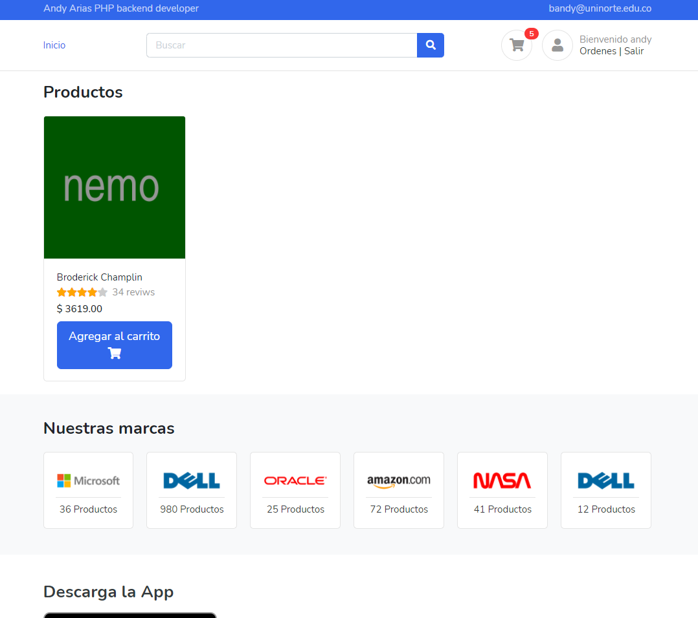

<p align="center"><a href="https://laravel.com" target="_blank"></a></p>

<p align="center">
<a href="https://travis-ci.org/laravel/framework"></a>
<a href="https://packagist.org/packages/laravel/framework"></a>
<a href="https://packagist.org/packages/laravel/framework"></a>
<a href="https://packagist.org/packages/laravel/framework"></a>
</p>

# evertec-tienda-prueba
Prueba tecnica empresa evertec, se desarrollo una SPA  que se integra con la pasarela de pagos place to pay utilizando las siguientes tenologias, Laravel, vue 3, intertial,bootstrap, voyager y php unit.

# Tienda


## Modulo Administrador
Para el desarrollo de este modulo se uso voyager, para visualizar este modulo se requiere crear un administrador y correr el seeder que generara el modulo de ordenes, en la instalacion se indicaran los comandos necesarios


## Variables de entorno

 ```php
 #Payment variebles
PAYMENT_LOGIN=6dd490faf9cb87a9862245da41170ff2
PAYMENT_TRANKEY=024h1IlD
PAYMENT_URL=https://dev.placetopay.com/redirection
PAYMENT_REST_TIME_OUT=45
PAYMENT_REST_CONNECT_OUT=30
 
 ```

## Configuracion

En el Archivo payment.php se encuentras las variables de autenticacion y de  estados de ordenes.
 ```php
 <?php

return [
    'auth' => [
        'login' => env('PAYMENT_LOGIN', '6dd490faf9cb87a9862245da41170ff2'),
        'tranKey' => env('PAYMENT_TRANKEY', '024h1IlD'),
        'url' =>  env('PAYMENT_URL', 'https://dev.placetopay.com/redirection'),
        'rest' => [
            'timeout' => env('PAYMENT_REST_TIME_OUT', 45),
            'connect_timeout' => env('PAYMENT_REST_CONNECT_OUT', 30),
        ],
    ],
    'states' => [
        //System and gateway values must match
        'gateway' => [
            'PENDING' => 'PENDING', //statu
            'APPROVED' => 'PAYED',
            'REJECTED' => 'REJECTED',
        ],
        'system' => [
            //name and color key are required 
            'PENDING' => [
                'name' => 'Pendiente',
                'color' => 'warning'
            ],
            'PAYED' => [
                'name' => 'Pagado',
                'color' => 'success'
            ],
            'REJECTED' => [
                'name' => 'Rechazado',
                'color' => 'danger'
            ],
        ],
        'initial'=>'PENDING',// initial stage when create order
        'retry' =>  'PENDING', // before payment request rejected
        'restart'=> 'REJECTED' //state to restart new payment request 
    ],

    'currency' => env('PAYMENT_CURRENCY', 'COP'),
];
 
 ```
### Auth
Son las variables correspondientes a la autenticacion con la pasarela de pago.
 ```php
<?php
 'auth' => [
        'login' => env('PAYMENT_LOGIN', '6dd490faf9cb87a9862245da41170ff2'),
        'tranKey' => env('PAYMENT_TRANKEY', '024h1IlD'),
        'url' =>  env('PAYMENT_URL', 'https://dev.placetopay.com/redirection'),
        'rest' => [
            'timeout' => env('PAYMENT_REST_TIME_OUT', 45),
            'connect_timeout' => env('PAYMENT_REST_CONNECT_OUT', 30),
        ],
    ],
```

### states
Estas Variblas intengran los estados de la pasarela de pagos junto a las del sistema, en este proyecto una orden solo puede tener 3 estados los cuales son PENDING,PAYED,REJECTED definidas en la llave states.system, las variebles de estado del sistema pueden tener un color y un nombre, el nombre sera el mostrado al usuario , el color debe pertenecer a los colores de boostrap 4.

``` php
'states' => [
        //System and gateway values must match
        'gateway' => [
            'PENDING' => 'PENDING', //statu
            'APPROVED' => 'PAYED',
            'REJECTED' => 'REJECTED',
        ],
        'system' => [
            //name and color key are required 
            'PENDING' => [
                'name' => 'Pendiente',
                'color' => 'warning'
            ],
            'PAYED' => [
                'name' => 'Pagado',
                'color' => 'success'
            ],
            'REJECTED' => [
                'name' => 'Rechazado',
                'color' => 'danger'
            ],
        ],

```
 - los siguentes estados son especiales y de cuidado.
``` php
        'initial'=>'PENDING',// initial stage when create order
        'restart'=> 'REJECTED' //state to restart new payment request 
```
- initial: Corresponde al estado inicial de la order y debe coindicir con alguno definido en la llave states.system.

- retry: En caso de que la pasarela  haya rechazado el pago, el estado retry indica en que estado de la order se podra  realizar una nueva peticion a la pasarela de para para intentar pagar por n sima vez.
## Instalacion de laravel
- cp .env.example .env .
- crear base de datos en tu sistema.
-  composer install
- php artisan key:generate
### creacion de administrador 
#### Intallar voyager
- php artisan voyager:install, en caso de fallar repetir comando.
#### crear usuario administrador
-  php artisan voyager:admin  {correo} --create .


#### correr Seeders
El siguiente  comando creara el modulo de ordenes en el administrador instalado (voyager) y generara el  producto con el cual se podra realizar ordenes.
- php artisan db:seed 


 
## License

The Laravel framework is open-sourced software licensed under the [MIT license](https://opensource.org/licenses/MIT).

